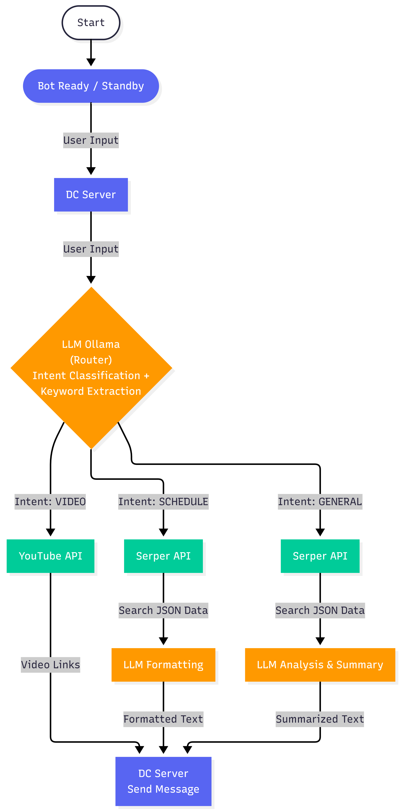

#  K-pop Information Agent (Discord Bot)

This is an intelligent Discord chatbot designed specifically for K-pop fans.
Leveraging **LLM (Large Language Model)** and **RAG (Retrieval-Augmented Generation)** technologies, it automatically identifies user intent to provide video searches, schedule queries, and general information retrieval.

##  Features

1.  **Extract keywords**: 
2.  **Intent Classification**: Uses an LLM to automatically analyze user input and classify the intent as `VIDEO`, `SCHEDULE`, or `GENERAL`.
    *   `Video Search`: Integrates with the **YouTube Data API** to accurately return links for performances, fancams, or music videos.
    *   `Schedule Management`: Integrates with the **Google Serper API** and uses an LLM to organize raw search results into a clean Markdown timeline/table.
    *   `General Q&A`: Performs web searches for general questions and summarizes the results into a concise Traditional Chinese (Taiwan) overview.

## 🛠️ System Architecture

This system utilizes a DAG (Directed Acyclic Graph) workflow design:



*(Please ensure your flowchart image is named system_diagram.jpg and placed in the project root directory, or modify the filename here)*

## 🚀 Prerequisites & Setup

### 1. Create Discord Bot & Invite to Server
If you are running this project for the first time, please follow these steps to create and invite the bot:

1.  **Create Application**:
    * Go to the [Discord Developer Portal](https://discord.com/developers/applications).
    * Click **New Application**, enter a name, and create it.
2.  **Configure Bot**:
    * Click **Bot** on the left sidebar -> **Add Bot**.
    * **Important**: Under the "Privileged Gateway Intents" section, enable **`MESSAGE CONTENT PRIVILEGE`**.
    * Click **Reset Token** to obtain your `DISCORD_TOKEN`.
3.  **Invite Bot to Server**:
    * Click **OAuth2** on the left sidebar -> **URL Generator**.
    * Under **SCOPES**, check `bot`.
    * Under **BOT PERMISSIONS**, check `Administrator` (or select `Send Messages`, `Read Messages` as needed).
    * Copy the **Generated URL** at the bottom, paste it into your browser, and select your test server to invite the bot.

### 2. Obtain External API Keys
* **Google Serper API**: Register at [Serper.dev](https://serper.dev/) to obtain a Key.
* **YouTube Data API v3**: Enable and obtain a Key from the [Google Cloud Console](https://console.cloud.google.com/).
* **LLM API Key**: Use the LLM service key from [Ollama](https://ollama.com/)

## ⚙️ Installation & Setup

#### 1. Clone the Repository
Open your terminal and run the following command to download the project:

```bash=
git clone https://github.com/Bigpig8787/THEORY-OF-COMPUTATION-FINAL-PROJECT.git
cd THEORY-OF-COMPUTATION-FINAL-PROJECT
```

#### 2. Set Up Virtual Environment

```bash=
python -m venv venv
.\venv\Scripts\activate
```

### 3. Install Dependencies
```bash=
pip install -r requirements.txt
```

### 4. Configure API Keys
For security reasons, the API keys are not stored in the repository. You must manually add them to the code.

Open bot.py in your text editor (VS Code, Notepad, etc.).

Locate the configuration section at the top of the file.

Replace the placeholder strings with your actual API keys:

```bash=
# bot.py

LLM_API_URL = "YOUR_LLM_URL"        # OLLAMA LLM URL
LLM_API_KEY = "YOUR_LLM_KEY"        # OLLAMA LLM Service Key from class
SERPER_API_KEY = "YOUR_SERPER_KEY"  # Google Serper API Key
YOUTUBE_API_KEY = "YOUR_YOUTUBE_KEY" # YouTube Data API v3 Key
DISCORD_TOKEN = "YOUR_DISCORD_TOKEN" # Discord Bot Token
MODEL_NAME = "gpt-oss:120b"
```